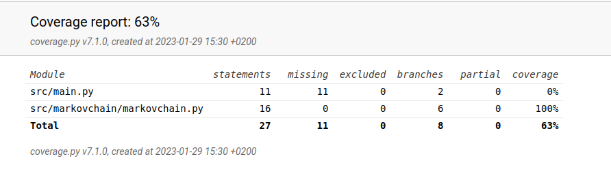

# Viikkoraportti 2

- ohjelmoinnin aloittaminen (pylintin, PEP 8 -tyylikirjaston ja unittestien asentaminen)
- ensimmäinen version ohjelmoiminen Markovin ketju -matriisista (laskee tulevia tiloja vain yhden solmun pituisille ketjuille)
- Markovin ketju -matriisin testien ohjelmointi
- tyhjän dummy-käyttöliittymän ohjelmointi

## Tällä viikolla tutustuin 

- todennäköisyyksien testaaminen
- erilaisiin syötemateriaaleihin tutustuminen

## Seuraavaksi

- Markovin ketju -matriisin opettaminen
- algoritmin kehittäminen, että tulevia tiloja voidaan laskea useamman solmun pituisten ketjujen pohjalta
- sopivan syötemateriaalin valitseminen 

## Käytetty tuntimäärä

8 tuntia

## Testikattavuus

Oteutettu Markov ketju -matriisi on testattu laajasti. Ohjelman käynnistävä main.py on tässä vaiheessa jätetty testien ulkopuolelle.

## Ratkaisua vaativia kysymyksiä:

- kuinka testaus toteutetaan. Yksikkötestauksella on helppo tarkistaa tietorakenteen toiminta, mutta miten algoritmin oikeellisuus testataan?
- onnistuisiko midin käyttäminen syötteenä
- riittääkö algoritmin opettamiseen yksi kappale vai tarvitaanko useita kappaleita
