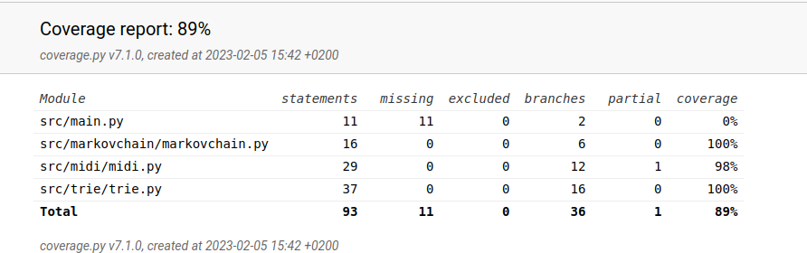

# Viikkoraportti 3

- midi-tiedostojen käsittely, midistä stringiksi ja stringistä midiksi
- trie-tietorakenteen ohjelmointi
- trie-tietokantaan ja midin käsittelyyn liittyvien testien ohjelmointi

## Tällä viikolla tutustuin 

- midin käsittely pythonillä
- Prefix Tree (trie) -tietorakenne pythonilla ja miten se soveltuu valittuun aiheeseen

## Seuraavaksi

- käyttöliittymän ohjelmointi
  - käyttäjä voi valita Prefixin pituuden, oletettavasti 1 - 5 nuottia, joiden pohjalta seuraava nuotti arvotaan
  - midi-tiedoston valinta
  - algoritmin kehittämän midi-tiedoston soittaminen ja tallentaminen
- miten nuotti arvotaan 
  - nyt algoritmi antaa listan mahdollisista vaihtoehdoista
  - riittääkö arpominen annetun listan vaihtoehdoista vai pitääkö alkuperäisen materiaalin pohjalta laksea painotuksia

## Käytetty tuntimäärä

15 tuntia

## Testikattavuus

Toteutettu Markov ketju -matriisi on testattu laajasti. Ohjelman käynnistävä main.py on tässä vaiheessa jätetty testien ulkopuolelle.

## Ratkaisua vaativia kysymyksiä:

- Prefixin pohjalta saatujen nuottivaihtoehtojen valinta - riittääkö arvonta listalta vai tarvitaanko alkuperäisen materiaalin pohjalta lasketut painotukset
- mitä muuta projektiin tulee vielä ottaa huomioon tai lisätä

