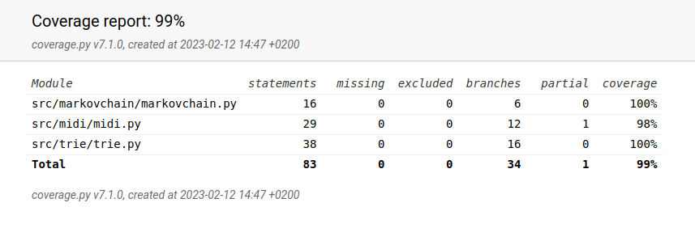

# Viikkoraportti 4

- trie-tietorakenteen käyttö nuottien tallentamiseen
- käyttöliittymän perustoimintojen ohjelmointi
- musiikin generoinnin ohjelmointi
- trie-tietorakenteen testaamisen suunnittelu pitkillä syötteillä

## Tällä viikolla tutustuin 

- musiikin generointi trie-tietorakenteen avulla

## Seuraavaksi

- käyttöliittymän ohjelmointi
  - syötteiden validointi ja virheilmoitukset
  - algoritmin kehittämän midi-tiedoston soittaminen
- kappaleen lopetus 
  -  mietittävä miten generoitu musiikki saadaan loppumaan hallitusti
- testaaminen pitkillä syötteillä 

## Käytetty tuntimäärä

12 tuntia

## Testikattavuus

Käyttöliittymä on jätetty testauksen ulkopuolelle.

