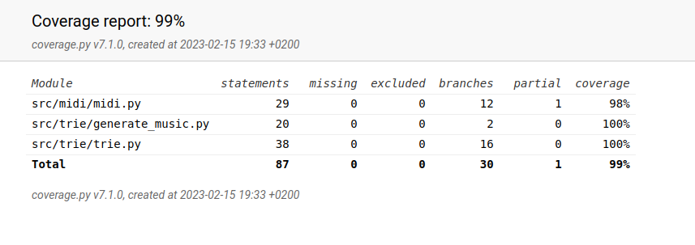

# Viikkoraportti 5

- säännöt uuden kappaleen lopettamiseen ja niiden ohjelmointi
- musiikin generoinnin vieminen omaan rekursiivisene fukntioon
  - funktio generoi uusia nuotteja, vaikka alkuperäistä prefixiä ei löytyisi triestä
- musiikin generointi funktion testit
- trie-tietorakenteen testaaminen pitkällä syötteellä

## Tällä viikolla tutustuin 

- algoritmien laaja testaaminen pitkillä syötteillä
- midin toistaminen ja siihen liittyvät ongelmat

## Seuraavaksi

- midi-tiedoston toistamisessa bugeja
  - kun pysäyttää toistamisen kesken, niin ohjelma kaatuu
  - kun yrittää toistaa samaa kappaletta uudelleen tai uutta kappaletta, niin ohjelma kaatuu
- suorituskykytestaus
  - testataan 10 nuotin, 100 nuotin ja 1000 nuotin midillä
  - 100 000 nuotin tallentaminen Triehen eri vaihtoehdoilla
  - 10 000 pituisen kappaleen generoiminen kaikilla eri Trie-vaihtoehdoilla
  - saadaan suorituskyky tallennuksen ja toiston osalta

## Käytetty tuntimäärä

22 tuntia

## Testikattavuus

Käyttöliittymä *ui.py* ja ohjelman käynnistävä *main.py* on jätetty testauksen ulkopuolelle.

## Ratkaisua vaativia kysymyksiä:

- midin toistamisen kanssa on ongelmia. Pygamen avulla midin voi toistaa ja toiston voi pysäyttää. Sen voi toteuttaa pygamen mixer.music.play:n kautta. Ongelma on siinä, että jos yrittää vaihtaa soitettavan tiedoston uuteen, niin ohjelma kaatuu. Onko kyseessä streamin tallennukseen liittyvä ongelma? Ainakaan en ole keksinyt miten tiedoston, johon stream tallennetaan, saisi suljettua. Vai onko ongelmana se, että kun tallennan midin tiedostoon generated.midi, niin sen avaaminen uudelleen kaataa ohjelman. Tähän en ole keksinyt mitään ratkaisua vielä.
