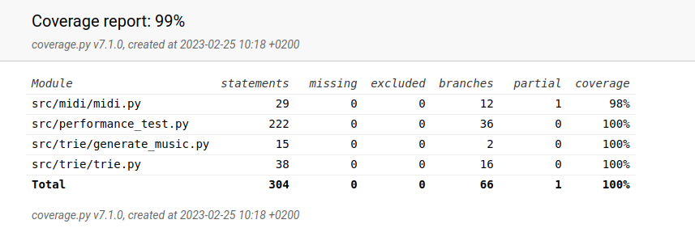

# Viikkoraportti 6

- generoidun musiikin toistamisen poistaminen ohjelmasta luotettavuusongelmien takia
- musiikin generointi -funktion testi pitkällä syötteellä
- dokumentointi

## Tällä viikolla tutustuin 

- algoritmien laaja testaaminen pitkillä syötteillä
- midin toistaminen ja siihen liittyvät ongelmat

## Seuraavaksi

- ohjelman ja dokumentoinnin viimeistely
- testaaminen toisella koneella

## Käytetty tuntimäärä

8 tuntia

## Testikattavuus

Käyttöliittymä *ui.py* ja ohjelman käynnistävä *main.py* on jätetty testauksen ulkopuolelle.

