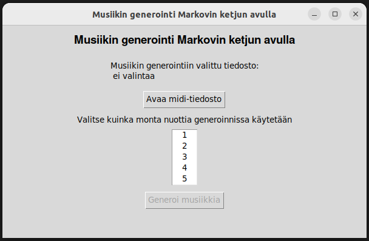
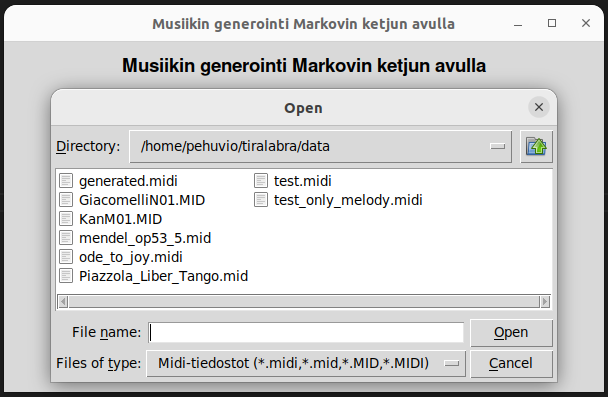
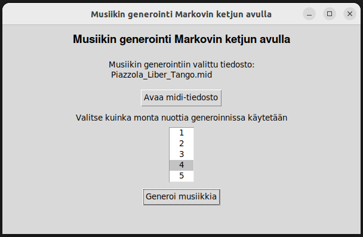

# Käyttöohje

Ohjelma täytyy ensin asentaa. Asennus tapahtuu komennolla:

```bash
poetry install
```

Sen jälkeen ohjelman pystyy suorittamaan komennolla:

```bash
poetry run invoke start
```

Ohjelman käyttöliittymä avautuu:


Seuraavaksi valitaan haluttu opetuskappale. *Data*-kansioon on tallennettu valmiiksi muutamia erityyppisiä kappaleita, joita voi käyttää opetusmusiikkina.


Sitten valitaan prefixin pituus.


Lopuksi klikkaamalla *Generoi musiikkia* -nappia generoitu musiikki tallentuu *data*-kansioon nimellä *generated.midi*.